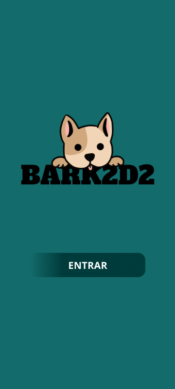
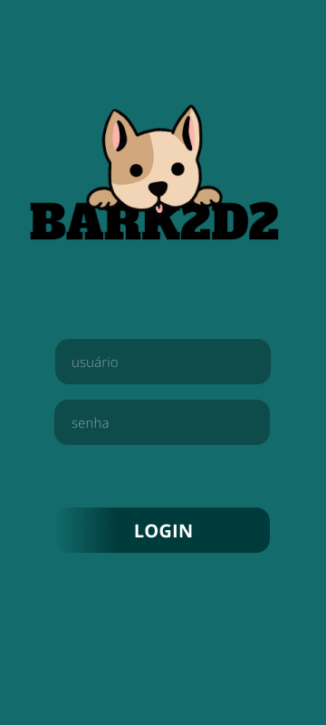
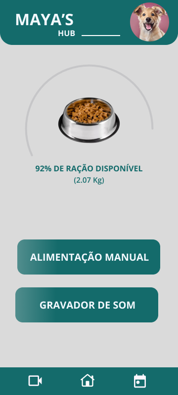

# Mobile App

This directory contains the source code and documentation for the mobile app developed in Flutter. The app serves as the interface for remotely controlling the automatic dog feeder, offering functionalities for management, monitoring, and real-time control.

<p align="center">
    
    
    
</p>

At the moment, the app is still under development. The current version includes:

- Documentation for the MQTT topics and schemas.
- A Figma prototype with the basic UI and interaction flows.

## App Features

- **Feeding Control**:
  - Manual and scheduled feeding.
- **Multimedia Features**:
  - Voice recording for playback during feeding.
  - Real-time video streaming via camera.
- **Monitoring**:
  - Real-time food level monitoring.
- **Security**:
  - Authentication with MQTT broker for secure access.

## Current Status

### What has been done:

- **MQTT Topics & Schemas**: The MQTT communication topics and schemas have been documented, allowing for integration with the pet feeder's firmware.
- **Prototype**: A basic prototype has been created in Figma, which defines the app’s layout and flow. However, further refinements are needed to optimize the user interface and experience.

### Pending Features and Improvements:

- **Feeding Control**: Implementation of manual and scheduled feeding functionalities. Currently, this feature is planned but not yet integrated.
- **Multimedia Features**: The voice recording and real-time video streaming capabilities are still in development.
- **Food Level Monitoring**: Real-time monitoring of food levels in the feeder has not yet been implemented.
- **Security**: MQTT broker authentication is being set up to ensure secure access and control.
- **User Interface**: The Figma prototype needs further improvements to better reflect the app’s features and enhance usability.

## Technologies Used

### Framework

- **Flutter**:
  - Cross-platform compatibility (iOS and Android).
  - Single codebase for simplified maintenance and consistent user experience.

### Communication

1. **WebSocket**:

   - **Package**: [web_socket_channel](https://pub.dev/packages/web_socket_channel).
   - Used to receive real-time images from the integrated camera on the feeder.

2. **MQTT**:
   - **Library**: [mqtt_client](https://pub.dev/packages/mqtt_client).
   - Manages publishing and subscribing to topics on the MQTT broker.

## Installation and Setup

### Prerequisites

- Flutter installed ([instructions](https://flutter.dev/docs/get-started/install)).
- MQTT broker configured.
- ESP32 device with WebSocket support.

### Steps

1. Clone the repository:
   ```bash
   git clone https://github.com/bru-oliveirax/bark2d2-dog-feeder.git
   ```
2. Navigate to the `/app` directory:
   ```bash
   cd app
   ```
3. Install dependencies:
   ```bash
   flutter pub get
   ```
4. Configure the MQTT broker and WebSocket URIs in the configuration file:
   ```bash
   const mqttBrokerUri = "mqtt://seu-broker.com";
   const webSocketUri = "ws://esp32.local:8080";
   ```
5. Run the app:
   ```bash
   flutter run
   ```
