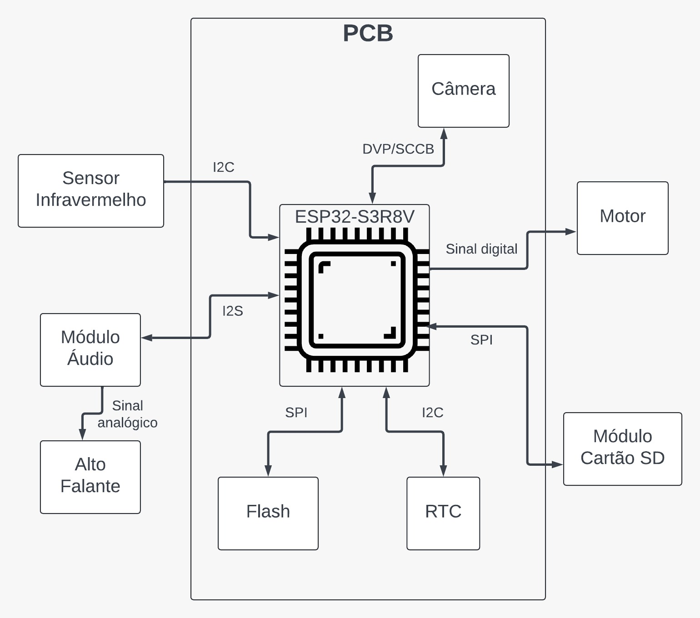

# Hardware

    

## Power Supply

- **Input Voltage:** 12V from an AC adapter.
- **Voltage Regulators:**
  - 5V regulator for SD card, audio module, and RTC.
  - 3.3V regulator for the ESP32-S3.
  - 1.8V regulator for external Flash and PSRAM.
  - Additional regulators (2.8V, 1.8V, 1.2V) for the camera.
- **Backup Power:** Lithium-ion battery pack (6 x 18650 cells, 12V, 30Ah).
- **Relay:** Switches between AC power and battery backup.

## Decoupling Capacitors

- **Purpose:** Filter high-frequency noise and stabilize power.
- **Types:** Ceramic capacitors (100nF, 1µF, 10µF) in parallel for broad frequency coverage.
- **Placement:** Close to power pins of ICs to minimize parasitic inductance.

## Reset Circuit

- **ESP32-S3 Reset Pin:** CHIP_PU, triggered by a low logic level.
- **Circuit:** RC delay with R = 10kΩ, C = 1µF to ensure proper reset timing.
- **External Reset:** If needed, an external reset chip or button is used for stability.

## Boot Process

- **Boot Pins:** GPIO0 and GPIO46 control the boot mode.
- **Bootloader:** Download via USB, GPIO0 pulled low during reset to initiate boot.

## Clock

- **Crystal:** 40MHz, precision ±10PPM, used for the ESP32-S3.
- **Layout:** Symmetrical, with proper grounding for stability.

## Hardware Components

### Motor

- **Specifications:** 12V, 35 RPM, 8.4 kg.cm.
- **Control:** GPIO pin to MOSFET (IRFZ44NLPBF) for motor activation.

### Camera

- **Model:** OV2640.
- **Power:** 2.8V (VDDA, VDDIO), 1.5V (VDDD).
- **Interface:** SCCB for control, DVP for data.

### Infrared Sensor

- **Model:** GP2Y0A21YK0F.
- **Power:** 1.8V.
- **Communication:** I2C (GPIO8 = SCL, GPIO9 = SDA).

### External Flash

- **Model:** W25Q64JWSSIQ.
- **Power:** 1.8V.
- **Interface:** SPI communication with the ESP32-S3.

### Audio Playback

- **Speaker:** 3" diameter, 4Ω, 3W.
- **Amplifier:** MAX98357A, using I2S protocol.
- **Audio Storage:** SD card (SPI communication).

### RTC Module

- **Model:** DS3231SN#.
- **Power:** 5V.
- **Communication:** I2C (GPIO8 = SCL, GPIO9 = SDA).
